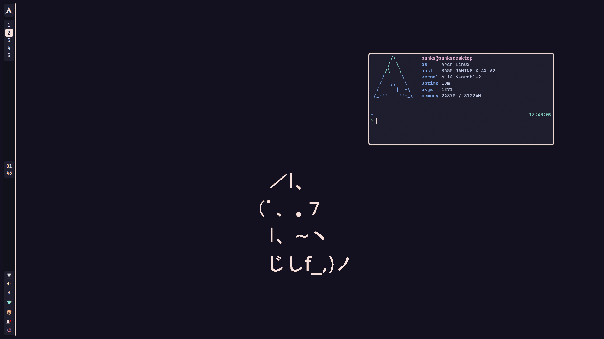

<h1 align="center">DE-Dotfiles</h1>



### A repository containing my dotfiles I use on my desktop.

## Desktop:

- **DE/WM:** Hyprland
- **Bar:** Waybar
- **Wallpaper:** SWWW and Waypaper
- **Terminal:** Kitty
- **Lock screen:** Hyprlock

> [!NOTE]
> My config before this was on GNOME, and I'm still transitioning over to Hyprland. As a result, some of the files here may not be needed if you're just trying to run the config shown here.

## Installation

This setup assumes you have at least basic knowlege of window managers, Arch, and how to configure everything. I don't have a magic script that can cover every edge case while installing, but I've tried my best to make what I can as smooth as possible.


### Manually (currently recommended)
> [!NOTE]
> This process uses `yay` extensively. It should work fine with another AUR helper (e.g. `paru`), but remember to substitute the commands out.

1. Install the required packages:
    ```shell 
    yay -S --needed git hyprland waybar swww waypaper walker swaync kitty grimblast-git polkitxdg-desktop-portal-hyprland xdg-desktop-portal-gtk hyprpolkitagent 
    ```
2. Optional packages: 
    ```shell 
    yay -S python-pywal16col <some display manager> nwg-look kvantum
    ```
3. Clone the repository:
    ```shell
    git clone https://github.com/bmalia/de-dotfiles.git
    ```
4. Copy out all of the configs:
    ```shell
    cd de-dotfiles
    cp .zshrc ~
    cp .config/* ~/.config
    ```
5. Get everything enabled \
[TBA]
> [!NOTE]
> My Hyprlock config uses a licensed font: Swear Display. If you don't own this font, you'll need to switch it out for something you do. This can be done by changing the `clock-font` variable in `hyprlock.conf`.
